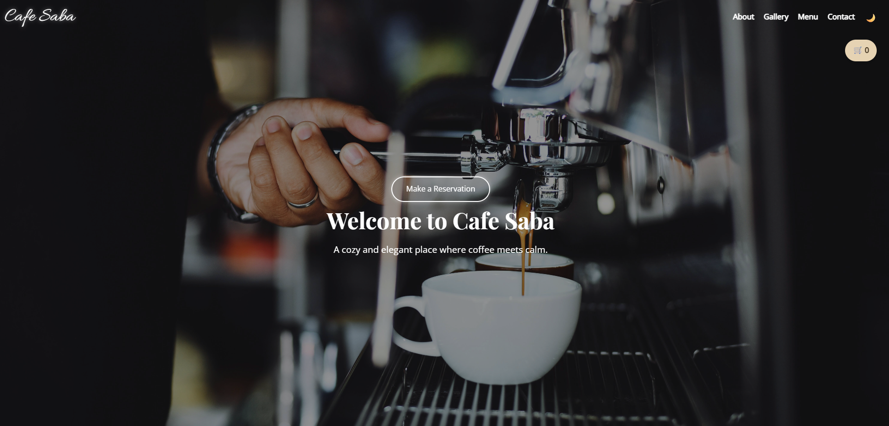

# ☕ Cafe Saba

**Cafe Saba** is a cozy and elegant coffee shop website designed to showcase a beautiful and functional front-end layout.  
Built with HTML, CSS, and JavaScript — this site offers a delightful user experience with modern UI features, responsive layout, dark/light mode, gallery filtering, and a reservation form.

---

## 📸 Screenshots





---

## 🛠 Technologies Used

- HTML5
- CSS3 (Flexbox & Grid)
- JavaScript (Vanilla)
- Responsive Design
- Dark/Light Theme Toggle
- Font: Great Vibes, Playfair Display, Open Sans
- Icon Fonts (for buttons, cart, etc.)

---

## 🚀 How to Run

1. Clone the repository:
   ```bash
   git clone https://github.com/saba97/cafe-saba.git

   2.Open Index.html in your browser
    ✅ That's it!

##  🔐 License & Usage

This project was created as a personal front-end portfolio project for practice and demonstration purposes.
Do not use, copy or redistribute this design or its code without explicit written permission from the author.

##  💌 Contact
Made with love by Saba Vafaei
Linkdin:Saba Vafaei
Email:vafaiesaba@gmail.com
🌐 Demo: https://saba97.github.io/Cafe-Saba/